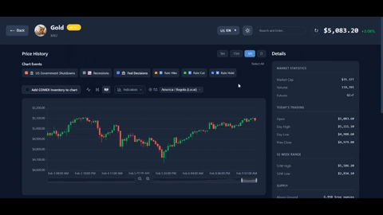

# Assets Market Cap Web App - Made with OpenCode + Claude Opus

This repository contains both frontend and backend files of a web app showcasing assets market cap rankings, combining data from commodities, stocks, and cryptocurrencies. Inside each asset page, you can see typical financial data you can find from similar patforms, such as current price, OHLC candles, trading volume, and other metrics. 

This web app is a personal project, 90% made by OpenCode (opencode.ai) using Claude Opus as the primary model. The remaining 10% were just bug fixes and small refactoring steps.

I deployed both the frontend and backend using Railway. You can check the web app directly here: 
[https://assets-market-cap-opencode-production-e827.up.railway.app/](https://assets-market-cap-opencode-production-e827.up.railway.app/)

Important Note: Keep in mind that I'm using free server and free data sources, so it might be a bit slow sometimes

## Railway Deployment Guide

You need two separate services in one Railway project, both connected to the same GitHub repo.

### Service 1: Backend (Python/Flask)
1. In your Railway project, click **"New Service" > "GitHub Repo"** and select your repo.
2. Go to **Settings** for this service:
   - **Root Directory**: `backend`
   - **Builder**: default - it will auto-detect Python from `requirements.txt` + `Procfile`
   - **Start Command**: should auto-detect from Procfile, but if not, set it to:
     ```
     gunicorn app:app --bind 0.0.0.0:$PORT --workers 2 --timeout 120
     ```
3. Go to **Variables** and add your environment variables:
   - `FRED_API_KEY` = your fredaccount API key (get one from `https://fredaccount.stlouisfed.org/apikeys`)
   - `TWELVEDATA_API_KEY` = your TwelveData API key (they have free plan at the time I write this readme guide, get one from `https://twelvedata.com/pricing`)
   - `FLASK_DEBUG` = `false`
4. Go to **Networking** and click **"Generate Domain"** (or add a custom domain). Note this URL, you'll need it for the frontend. It will look like `https://your-backend-service.up.railway.app`.

### Service 2: Frontend (Vite/React)
1. Click **"New Service" > "GitHub Repo"** again, same repo.
2. Go to **Settings** for this service:
   - **Root Directory**: leave empty (root `/` of the repo)
   - **Build Command**: `npm install && npm run build`
   - **Start Command**: `npm run start`
3. Go to **Variables** and add:
   - `VITE_API_URL` = the backend URL from step 4 above (e.g., `https://your-backend-service.up.railway.app`)
   **Important**: `VITE_API_URL` must be set **before the build** because Vite inlines it at build time. If you add/change it later, you must trigger a redeploy.
4. Go to **Networking** and click **"Generate Domain"** for the frontend. This is the public URL users visit.

### Final Railway Setup
After both services deploy:
- Frontend at `https://your-frontend.up.railway.app` serves the React app
- Frontend JS calls `https://your-backend.up.railway.app/api/*` (CORS is already enabled)
- Backend runs Flask via gunicorn with proper `$PORT` binding

#### Web App Preview:


### Run Locally
The app is designed to work in both local development and Railway production environments. You can still run it locally if you don't want to deploy it on Railway (or similar services).

**Quick Start:**
```bash
npm run dev:all
```

This single command starts both the backend (Flask dev server on `localhost:5000`) and frontend (Vite dev server) with hot-reload enabled.

**First time setup for Local Development:**
```bash
# Install backend dependencies
cd backend
pip install -r requirements.txt

# Install frontend dependencies (from project root)
cd ..
npm install

# Optional: Add API keys for FRED/TwelveData
cd backend
cp .env.example .env
# Edit .env and add your keys

# Run both services
cd ..
npm run dev:all
```

**Note:** The Railway-specific files (`Procfile`, `npm run start`) are only used in production and don't affect local development.

### Troubleshooting

- If the frontend shows API errors, check that `VITE_API_URL` was set **before** the build ran (redeploy if needed).
- If the backend fails to start, check the deploy logs — it's usually a missing env var or a Python package issue.
- The backend `--timeout 120` in gunicorn gives your yfinance/API calls up to 2 minutes before timing out (some endpoints are slow).

## Re-enabling Optional Features

Some features are commented out by default. To re-enable them:

### Regional Premium Prices (Gold & Silver)

The Shanghai and India premium comparison sections are currently commented out. This feature compares gold and silver prices against Indian (MCX) and Chinese (SGE) spot prices, data is acquired from https://metalcharts.org. You can actually use this feature in a local development, but might get your request blocked when you deploy the app somewhere.

**To re-enable:**
- File: `src/pages/AssetDetailPage.tsx`
- Lines: 799-806
- Action: Uncomment the following block:
  ```tsx
  {/* Shanghai & India Premium Prices - only shows for gold and silver */}
  {/* COMMENTED OUT - To re-enable, uncomment lines 799-806 in AssetDetailPage.tsx */}
  {/* {assetType === 'metal' && details?.symbol && hasPremiumData(details.symbol) && (
    <PremiumPrices 
      symbol={details.symbol} 
      metalName={details.name || id}
      westernPrice={currentPrice}
    />
  )} */}
  ```

Simply remove the `{/* */}` comment markers to restore the regional premium functionality.

## Data Sources

This application uses two data sources for market data:

### yfinance (Yahoo Finance)
- Used for: company info, historical data, period changes (7d, 30d, etc.), homepage prices, commodity prices

### TwelveData
- Requires API key (`TWELVEDATA_API_KEY` in `.env`)
- Free tier: 800 API calls/day, 8 calls/minute
- Used for: real-time stock/crypto prices, historical candles in the asset pages, 24h change
- For crypto, I intentionally only return 2 assets (BTC and ETH), to avoid rate limitations on TwelveData free API plan. Check `CRYPTO_TICKERS` inside `backend/app.py`.
- Features: More reliable intraday data than yfinance. You may want to fully use TwelveData API if you have a paid plan with them

IMPORTANT: international stocks are not provided by TwelveData FREE API plan, so the fallback always goes to yfinance. and quite frequently, the chart historical data from yfinance may return empty history. This is because yfinance has different endpoints from showing the quote/current price vs. history endpoint:
1. **Price/Quote endpoint** (search results, details) — uses `yfinance.Ticker(symbol).info` which returns current price, market cap, shares outstanding, etc. This works for 2899.HK because yfinance can fetch the *current* quote data.

2. **History endpoint** (charts) — uses `yfinance.Ticker(symbol).history(period=..., interval=...)` which fetches OHLCV candles. This is a different API call that can fail for certain symbols/intervals (e.g., intraday data for HK stocks may not be available or may be restricted).

If you want to reliably return historical charts for non-US stocks, I strongly recommend using TwelveData paid plans or find other data providers.

### Why the Hybrid Approach?

- **Price & 24h Change**: TwelveData provides real-time quotes with more reliable and accurate quote endpoints
- **Market Cap**: Calculated as `yfinance circulating_supply × TwelveData real-time_price`. yfinance provides circulating supply data for crypto, and TwelveData provides the real-time price. This gives an accurate real-time market cap.
- **Period Changes (7D, 30D, 60D, 90D, 180D, YTD)**: yfinance is used because it provides 1 year of historical data needed to calculate these changes. TwelveData's free tier has rate limits that make fetching extensive history for multiple cryptos impractical.


### Market Cap Calculation

For **crypto (main page and detail pages)**:
- Market Cap = `yfinance circulating_supply` × `TwelveData current_price`
- TwelveData's free tier does not provide statistics data that is needed for the asset pages here
- yfinance provides `circulatingSupply` for all major cryptocurrencies (this value changes slowly)
- TwelveData provides the real-time price, so the calculated market cap stays current

For **stocks in search results and detail pages**:
- Market Cap = `yfinance shares_outstanding` × `TwelveData current_price`
- This ensures the market cap reflects the real-time price from TwelveData

For **main page stocks and metals/commodities**:
- Market Cap = directly from yfinance

### Stock Listing Order (SlickCharts Integration)

The application uses **SlickCharts** (https://www.slickcharts.com/sp500) as the source for determining which stocks to display and in what order.

#### How it works:

1. **Daily Refresh**: At startup (and daily thereafter), the backend scrapes SlickCharts to get all ~503 S&P 500 stocks sorted by their index weight, which directly correlates with market capitalization.

2. **Cache File**: The ordered list is cached in `backend/data/top_stocks_list.json` (filename is legacy, but contains all ~503 stocks).

3. **Market Cap Order**: SlickCharts sorts stocks by S&P 500 index weight, which is proportional to market cap. So stocks #1-30 are the largest by market cap, stocks #31-60 are the next largest, etc.

4. **"Show Next 30" Feature**: When you click "Show Next 30", the app requests stocks #31-60 (or #61-90, etc.) from this pre-sorted list. These are truly the next-largest companies by market cap, not alphabetical.

5. **Final Sort**: After fetching price data from yfinance, the app re-sorts by current market cap to ensure the most accurate ordering (since market caps fluctuate).

#### Data Flow:

```
SlickCharts (www.slickcharts.com/sp500)
    │
    ▼ (scrapes HTML table, daily)
backend/data/top_stocks_list.json (all ~503 stocks in market cap order)
    │
    ▼
/api/stocks?limit=N (takes first N stocks from sorted list)
    │
    ▼
yfinance (fetches current price, market cap, etc.)
    │
    ▼
Final sort by market cap descending → Frontend display
```

#### Files involved:

| File | Purpose |
|------|---------|
| `backend/data_refresher.py` | `_fetch_sp500_from_slickcharts()` - scrapes SlickCharts |
| `backend/data/top_stocks_list.json` | Cached list of all S&P 500 stocks in market cap order |
| `backend/app.py` | `SP500_MARKETCAP_ORDER` - loads and uses the sorted list |

#### Fallback:

If SlickCharts is unavailable, the system falls back to:
1. Cached data from `top_stocks_list.json`
2. Hardcoded `FALLBACK_TOP_30` list (approximately top 30 by market cap)

### Fallback Behavior

- If TwelveData is unavailable (no API key, rate limited, or error), the system automatically falls back to yfinance
- The API response includes a `data_source` field indicating which source was used
- TwelveData doesn't work for HK/Tokyo stocks | Free tier = US only, Pro required for international | Falls back to yfinance  (and yfinance sucks for international stocks data)

### Current API Calls Credit

Check API credits TwelveData documentation below, that's why when you are using a free plan, you need to be wise with the API calls (this is the part where you can't fully automate using OpenCode)

#### API Credits TwelveData Documentation
https://support.twelvedata.com/en/articles/5615854-credits


### Refresh Data per how many minutes and per how many candles
Data by default refresh every few minutes. To change this, go to `backend/data_refresher.py` and change `ASSET_PAGE_REFRESH_MINUTES`. Also for how many candles to be refreshed every x minutes, change `ASSET_PAGE_REFRESH_CANDLES`.

Make sure to also edit `AUTO_REFRESH_INTERVAL` in `src/hooks/useAutoRefreshCountdown.ts` to match `ASSET_PAGE_REFRESH_MINUTES` in `backend/data_refresher.py`.

## Configuration Options

### Frontend Configuration (`src/config.ts`)

| Option | Default | Description |
|--------|---------|-------------|
| `STRICT_MODE` | `false` | React StrictMode toggle. When `true`, React runs effects twice in dev mode to detect bugs (causes double API calls). When `false`, effects run once like production. Only affects development builds. |

### Backend Configuration (`backend/data_refresher.py`)

| Option | Default | Description |
|--------|---------|-------------|
| `ASSET_PAGE_REFRESH_MINUTES` | `3` | How often the asset detail page auto-refreshes |
| `ASSET_PAGE_REFRESH_CANDLES` | `3` | Number of recent candles to fetch on each refresh |
| `STATISTICS_ASSET_PAGE_TWELVEDATA` | `False` | Whether to use TwelveData `/statistics` endpoint. Set to `False` on free tier (saves 1 API credit per page visit). The `/statistics` endpoint requires TwelveData Pro plan - on free tier it always fails but still consumes a credit.

### TwelveData API Credits Per Asset Page Visit

| Endpoint | Credits | Requires Pro? | Purpose |
|----------|---------|---------------|---------|
| `/time_series` | 1 | No | Chart history data |
| `/quote` | 1 | No | Current price, today's OHLCV |
| `/statistics` | 1 | **Yes** | Shares outstanding, avg volume (skipped when `STATISTICS_ASSET_PAGE_TWELVEDATA=False`) |

**With default config:** 2 credits per page visit (free tier friendly)
**With `STATISTICS_ASSET_PAGE_TWELVEDATA=True`:** 3 credits per page visit (1 wasted on free tier)